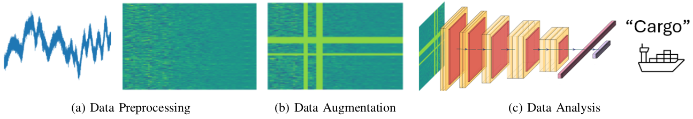

# Transfer Learning for Passive Sonar Classification using Pre-trained Audio and ImageNet Models:
<p align="center">
  
</p>


**Transfer Learning for Passive Sonar Classification using Pre-trained Audio and ImageNet Models**

Amirmohammad Mohammadi, Tejashri Kelhe, Davelle Carreiro, Alexandra Van Dine and Joshua Peeples

Note: If this code is used, cite it: Amirmohammad Mohammadi, Tejashri Kelhe, Davelle Carreiro, Alexandra Van Dine and Joshua Peeples. (2024, August 30) Peeples-Lab/PANN_Models_DeepShip: Initial Release (Version v1.0). 
[`Zendo`](https://doi.org/10.5281/zenodo.13886743).https://zenodo.org/records/13886743
[](https://doi.org/10.5281/zenodo.13886743)

In this repository, we provide the paper and code for "Transfer Learning for Passive Sonar Classification using Pre-trained Audio and ImageNet Models."

## Installation Prerequisites

The [`requirements.txt`](requirements.txt) file includes the necessary packages, and the packages will be installed using:

   ```pip install -r requirements.txt```


## Demo

To get started, please follow the instructions in the [Datasets](Datasets) folder to download the dataset.
Next, run [`demo_light.py`](demo.py) in Python IDE (e.g., Spyder) 

## Parameters

The parameters can be set in the following script:
   
[`Demo_Parameters.py`](Demo_Parameters.py)

## Inventory

```
https://github.com/Peeples-Lab/PANN_Models_DeepShip

└── root directory
    ├── demo_light.py                     // Run this. Main demo file.
    ├── Demo_Parameters.py                // Parameter file for the demo.
    └── Datasets                
        ├── Get_Preprocessed_Data.py      // Resample the audio data and generate segments for the dataset.
        ├── SSDataModule.py               // Load and preprocess the dataset.
    └── Utils                     
        ├── Network_functions.py          // Contains functions to initialize the modelS.
        ├── PANN_models.py          	  // Contains the PANN modelS.
        ├── LitModel.py                   // Prepare the PyTorch Lightning framework.


```

## License

This source code is licensed under the license found in the [`LICENSE`](LICENSE) file in the root directory of this source tree.

This product is Copyright (c) 2024 A. Mohammadi, T. Kelhe, D. Carreiro, A. Dine and J. Peeples. All rights reserved.


